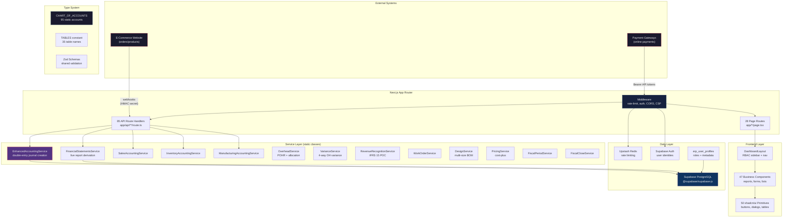
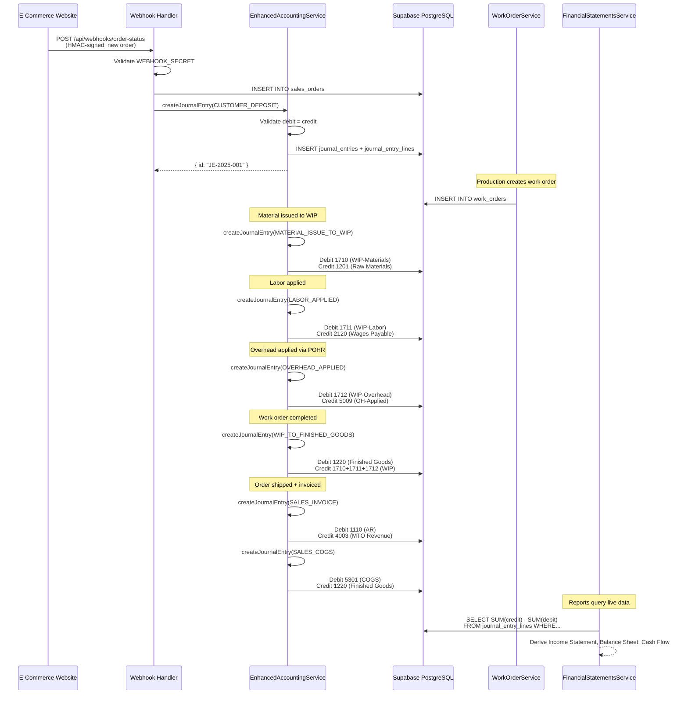
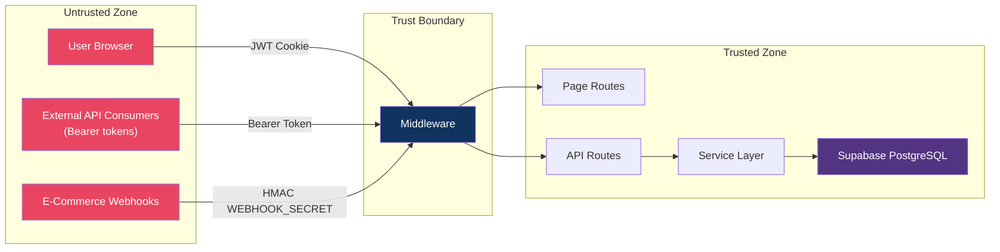

# AccuFinance — Principal-Level Onboarding

> **Audience**: Senior/staff+ engineers who need the "why" behind every decision.
> **System**: Manufacturing ERP for MTO (Make-to-Order) garment production — "TEL U ASEGH"
> **Language**: TypeScript 5.9 (strict mode), Next.js 14 App Router

---

## 1. System Philosophy & Design Principles

### Core Invariants

The system maintains these invariants at all times:

| # | Invariant | Enforcement |
|---|-----------|-------------|
| I1 | **Double-entry always balances** — every journal entry must have total debits = total credits | `EnhancedAccountingService.createJournalEntry()` validates before insert (`lib/services/enhanced-accounting-service.ts:230`) |
| I2 | **Balances are never cached** — all financial reports derive balances live from `journal_entries` + `journal_entry_lines` | No cache layer exists; `FinancialStatementsService` queries journal entries directly (`lib/services/financial-statements-service.ts:1`) |
| I3 | **No ORM abstraction** — all database access is raw SQL via `@supabase/supabase-js` | `db(table)` helper wraps `supabase.from(table)` (`lib/supabase.ts:102`) |
| I4 | **Chart of Accounts is the single source of truth** — account codes, types, sub-types, and normal balances are defined in one file | `CHART_OF_ACCOUNTS` constant in `lib/accounting/account-types.ts:82` |

### Key Design Choices

**Why static TypeScript for the Chart of Accounts instead of database records?**
The Chart of Accounts *is* the schema. There are 95 accounts covering assets (1xxx), liabilities (2xxx), equity (3xxx), revenue (4xxx), COGS (5xxx), expenses (6xxx), and other (7xxx). These don't change at runtime — they define the financial structure of the business. Making them database records would allow accidental modification. TypeScript gives us compile-time safety and the `ACCOUNT_CODES` enum gives us IDE autocompletion.

**Why no ORM?**
The system was built from scratch without a migration from an existing ORM-based codebase. Every query is explicit SQL through Supabase's client. This avoids the N+1 problem endemic to ORMs, gives direct control over query performance, and makes the service layer the single place where data access logic lives. The trade-off is more boilerplate — but in an accounting system, correctness over conciseness is the right call.

**Why live balance calculation instead of cached balances?**
Cached balances create reconciliation problems. If a journal entry is inserted but the cache update fails (or is delayed), the balance sheet and trial balance disagree. By computing balances live from journal entries on every request, we eliminate an entire class of consistency bugs. The `CentralizedAccountingService.syncAccountBalance` method is explicitly deprecated for this reason (`CLAUDE.md:24`).

### Accounting Standards Compliance

The system follows:
- **IAS 2** — Inventories (FIFO cost layering via `InventoryLayerService`)
- **IFRS 15 / ASC 606** — Revenue from Contracts with Customers (percentage-of-completion via `RevenueRecognitionService`)
- **IAS 37** — Provisions (onerous contract provisions at account `2155`)
- **IAS 23** — Borrowing Costs
- **IAS 36** — Impairment of Assets
- **COSO Framework** — Internal control principles

---

## 2. Architecture Overview

### Component Map



### Communication Patterns

| Pattern | Description | Example |
|---------|-------------|---------|
| **HTTP/REST** | All client-server communication via Next.js API routes | `app/api/sales-orders/route.ts` → `SalesAccountingService` |
| **Service composition** | Services call each other as needed (static classes, no DI container) | `EnhancedAccountingService` imports `SalesAccountingService`, `InventoryAccountingService`, `ManufacturingAccountingService` |
| **Webhook ingress** | External e-commerce site pushes orders via signed webhooks | `app/api/webhooks/order-status/route.ts` — authenticated via shared `WEBHOOK_SECRET` |
| **Direct DB access** | Services read/write Supabase directly using service role client (bypasses RLS) | `getServiceSupabase()` provides `SUPABASE_SECRET_KEY` auth (`lib/supabase.ts:36`) |
| **Batch inserts** | Multiple row inserts use a PostgreSQL RPC function for atomicity | `batchInsert(table, rows)` calls `rpc("batch_insert")` (`lib/supabase.ts:107`) |

### Module Ownership

Each page module owns its data end-to-end:

```
/sales-orders → SalesAccountingService → sales_orders, journal_entries
/work-orders   → WorkOrderService        → work_orders, inventory_items
/inventory     → InventoryAccountingService → inventory_items, inventory_movements, inventory_layers
/designs       → DesignService           → designs, bom
/invoices      → EnhancedAccountingService → invoices, journal_entries
```

---

## 3. Key Abstractions & Interfaces

### The Journal Entry Model

Every financial event flows through `EnhancedAccountingService.createJournalEntry()`. This is the single writer of all financial data:

```typescript
// lib/services/enhanced-accounting-service.ts:230
async createJournalEntry(params: {
  date: string
  reference: string
  description: string
  entryType: JournalEntryType
  lines: Array<{
    accountCode: string    // Must match CHART_OF_ACCOUNTS key
    accountName: string    // Verified against CHART_OF_ACCOUNTS
    debit: number          // Debit amount (0 if credit line)
    credit: number         // Credit amount (0 if debit line)
    customerId?: string
    vendorId?: string
    metadata?: Record<string, any>
  }>
  createdBy?: string
}): Promise<{ id: string }>
```

**Critical constraint**: Total debits must equal total credits within each entry. This is validated before insertion.

### The Table Name System

All table names are centralized in the `TABLES` constant (`lib/supabase.ts:59-95`):

```typescript
export const TABLES = {
  JOURNAL_ENTRIES: "journal_entries",
  JOURNAL_ENTRY_LINES: "journal_entry_lines",
  SALES_ORDERS: "sales_orders",
  WORK_ORDERS: "work_orders",
  INVENTORY_ITEMS: "inventory_items",
  // ... 35 tables total
} as const
```

Services never hard-code table names. The `TABLES` constant provides type safety and makes schema changes auditable.

### The Chart of Accounts Hierarchy

```
Account (interface)
├── code: string          // e.g. "1101"
├── name: string          // English name
├── nameAr?: string       // Arabic name (bilingual system)
├── type: AccountType     // ASSET, LIABILITY, EQUITY, REVENUE, COGS, EXPENSE, etc.
├── subType: AccountSubType  // CASH, RECEIVABLE, INVENTORY, PAYABLE, etc.
├── normalBalance: "debit" | "credit"
├── parentCode?: string   // For sub-accounts (e.g., 1710 parent is 1210)
├── isActive: boolean
├── isSystemAccount: boolean  // True = required by the system, cannot be deleted
└── isCashFlowTracked: boolean
```

### The User Authorization Model

Six roles with granular permissions (`lib/supabase-auth-service.ts:23-64`):

| Role | Scope | Key Permissions |
|------|-------|-----------------|
| `admin` | `*` (wildcard) | Full system access |
| `accountant` | Finance | journal-entries, invoices, payments, reports, chart-of-accounts |
| `warehouse` | Inventory | inventory, purchase-orders, vendors, bom |
| `sales` | Sales | sales-orders, customers, designs |
| `production` | Factory | work-orders, bom, designs |
| `viewer` | Read-only | dashboard, reports |

Permission checking is a simple string match: `hasPermission(role, "inventory:*")` checks if the role has the resource wildcard or exact match.

---

## 4. Decision Log

| # | Decision | Context | Alternatives Considered | Trade-offs |
|---|----------|---------|------------------------|------------|
| ADR-01 | **No ORM** | Greenfield ERP build; needed full control over SQL for accounting accuracy | Prisma, Drizzle, Knex | More boilerplate, but zero abstraction leaks and full query visibility |
| ADR-02 | **Live balance computation** | Accounting systems must never show stale data | Cached balances with invalidation | Higher DB load per report request, but eliminates cache consistency bugs entirely |
| ADR-03 | **Static Chart of Accounts** | Accounts are a schema definition, not runtime data | Database table with CRUD | Cannot add accounts at runtime (needs code deploy), but prevents accidental corruption |
| ADR-04 | **Static service classes (no DI)** | Small team, straightforward dependency graph | NestJS with DI, tsyringe | Tight coupling between services, but simpler debugging and no DI magic |
| ADR-05 | **next-auth v4 over v5** | Auth needed stable solution; v5 was beta at project start | Auth0, Clerk, custom JWT | v4 Credentials provider is mature; migration path to v5 exists |
| ADR-06 | **Supabase over raw PostgreSQL** | Needed managed DB with auth, real-time, and storage | AWS RDS, Neon, PlanetScale | Vendor lock-in to Supabase, but unified platform reduces ops burden |
| ADR-07 | **App Router over Pages Router** | Next.js 14 default; needed server components for report generation | Pages Router | Higher learning curve for team, but better performance and streaming support |
| ADR-08 | **shadcn/ui over custom design system** | Needed accessible UI components fast | Material UI, Ant Design, Chakra | shadcn/ui provides source-level control (components live in our code) vs npm black boxes |
| ADR-09 | **Zod for validation (shared between client and server)** | Need consistent validation in forms and API routes | Yup, Joi, class-validator | Zod's TypeScript inference eliminates duplicate type definitions |
| ADR-10 | **Bearer token API auth alongside JWT sessions** | Webhook consumers and scripts need programmatic access | OAuth2, API keys in headers | Simpler to implement; `resolveBearerToken()` checks against multiple env vars |

---

## 5. Dependency Rationale

| Dependency | Why Chosen | What It Replaces |
|------------|-----------|------------------|
| `@supabase/supabase-js` | Official SDK; provides PostgreSQL + Auth + Realtime in one package | Raw `pg` driver |
| `next-auth` v4 | Industry standard for Next.js auth; Credentials provider for Supabase Auth integration | Custom JWT implementation |
| `zod` | TypeScript-first schema validation; `.infer` creates types from schemas | PropTypes, manual validation |
| `react-hook-form` + `@hookform/resolvers` | Performant form state management with Zod integration | Formik, manual state |
| `shadcn/ui` + `@radix-ui/*` | Headless, accessible UI primitives; components live in our repo | MUI, Chakra (opaque npm packages) |
| `recharts` | Lightweight React charting for financial dashboards | D3 (too low-level), Chart.js |
| `@upstash/ratelimit` + `@upstash/redis` | Serverless-compatible rate limiting; Redis sliding window | Custom in-memory tracker (not horizontally scalable) |
| `tailwindcss` v4 | Utility-first CSS; v4 CSS-first config (no `tailwind.config.js` needed) | CSS Modules, styled-components |
| `bcryptjs` | Pure JS bcrypt (no native deps) for password verification | `bcrypt` (native, build issues) |
| `date-fns` | Tree-shakeable date utilities | moment.js (deprecated) |
| `sonner` | Toast notifications | react-hot-toast |
| `lucide-react` | Open-source icon library with tree-shaking | Heroicons, custom SVGs |
| `ws` | WebSocket server for background job notifications | Socket.io (heavier) |

---

## 6. Data Flow & State

### End-to-End Order Lifecycle



### State Management Philosophy

- **Server state**: Lives in Supabase PostgreSQL. No client-side cache of financial data.
- **Session state**: JWT stored in an HTTP-only cookie managed by next-auth.
- **UI state**: React component state (`useState`) for form inputs, dialog open/close, filters.
- **No global state library**: The app doesn't use Redux, Zustand, or Context for business data. Each page fetches its own data from API routes.

### Read vs Write Paths

| Path | Client | Auth | Service | Database |
|------|--------|------|---------|----------|
| **Read** (reports, lists) | `fetch("/api/reports/...")` → component state | JWT cookie or Bearer token → middleware validates → route handler | Service queries Supabase directly | Returns rows to client |
| **Write** (create order, journal entry) | `fetch("/api/work-orders", { method: "POST", body })` | JWT cookie → middleware → route handler | Service validates with Zod → calls createJournalEntry | Double-entry insert |

---

## 7. Failure Modes & Error Handling

### Known Failure Modes

| # | Scenario | Impact | Detection | Recovery |
|---|----------|--------|-----------|----------|
| FM-01 | **Redis unavailable** | Rate limiting cannot run | Middleware logs warning; requests pass through (fail-open) | Redis auto-recovers; no intervention needed (`middleware.ts:267`) |
| FM-02 | **Supabase connection failure** | All API calls fail with 500 | Next.js error boundary catches; returns JSON error | Retry with exponential backoff (not implemented) |
| FM-03 | **Journal entry debit/credit mismatch** | Entry rejected before DB insert | `createJournalEntry()` validates totals | Client shows validation error; must fix and resubmit |
| FM-04 | **Duplicate webhook delivery** | Duplicate orders created | Webhook handler checks for existing `orderId` | Idempotency: second delivery returns 200 with existing order |
| FM-05 | **JWT token expiry** | User redirected to login | Middleware returns 401 for API, redirects for pages | next-auth handles silent refresh; maxAge is 24 hours |
| FM-06 | **batch_insert RPC not found** | Batch inserts fail | `batchInsert()` throws error | Individual inserts as fallback |

### Error Propagation Pattern

```
Service Layer Exception
    ↓
API Route Handler (try/catch)
    ↓
NextResponse.json({ success: false, error: message }, { status })
    ↓
Client Component (try/catch in fetch)
    ↓
Toast notification (sonner) + error state in UI
```

Services throw standard JavaScript errors. API handlers catch them and return structured JSON: `{ success: false, error: string }`. The client displays errors via `sonner` toast notifications.

### Validation Layers

1. **Client-side**: Zod schemas via `react-hook-form` + `@hookform/resolvers/zod` — immediate feedback in forms
2. **API route**: Zod schemas again (shared from `lib/validation/`) — validates request bodies
3. **Service layer**: Business logic validation (e.g., debit/credit balance, account code existence, inventory availability)
4. **Database**: PostgreSQL constraints (foreign keys, NOT NULL, CHECK constraints)

---

## 8. Performance Characteristics

### Hot Paths

| Path | Frequency | DB Queries | Optimization Status |
|------|-----------|------------|---------------------|
| Dashboard overview | Every page load | 5-8 queries (revenue, expenses, pending orders, cash balance) | Acceptable; consider caching with SWR |
| Income Statement | On-demand | 1 large aggregation query across all journal entry lines for the period | Could benefit from materialized views for monthly snapshots |
| Balance Sheet | On-demand | 1 aggregation query per account type group | Currently queries all lines; filtering by account code range would help |
| Sales Orders list | Every page load | 1 query with join to customers | Pagination limits results; acceptable |
| Work Orders list | Every page load | 1 query with join to sales_orders | Acceptable |

### Scaling Limits

- **Current scale**: Single garment factory, <100 concurrent users
- **Report generation bottleneck**: Balance sheet derivation reads all journal entry lines since inception. For a factory processing ~1000 orders/month, this is ~50,000 lines/year — well within PostgreSQL limits.
- **Rate limit**: 100 requests per 60 seconds per IP (Upstash Redis sliding window)
- **JWT session**: 24-hour max age; no refresh token rotation

### Database Design Impact

- No ORM = no lazy loading surprises. Every query is explicit.
- `journal_entry_lines.account_code` has an index for report aggregation queries.
- `batch_insert` RPC wraps multiple inserts in a transaction for atomicity.

---

## 9. Security Model

### Trust Boundaries



### Authentication Methods

| Method | Used By | Token Location | Validation |
|--------|---------|---------------|------------|
| JWT Cookie | Browser users (login form) | `next-auth.session-token` cookie | `getToken()` in middleware (`middleware.ts:290`) |
| Bearer token (admin) | External scripts, CI/CD | `Authorization: Bearer <token>` header | Checked against `API_SECRET`, `NEXTAUTH_SECRET`, `API_ADMIN_TOKENS` (`middleware.ts:200`) |
| Bearer token (read-only) | Monitoring dashboards | `Authorization: Bearer <token>` header | Checked against `API_READ_TOKENS`; blocked from POST/PUT/DELETE (`middleware.ts:314`) |
| HMAC secret | Webhook consumers | `x-webhook-signature` header | Validated in webhook route handlers against `WEBHOOK_SECRET` |

### Authorization

- Page-level: `DashboardLayout` filters navigation items by role permissions (`components/dashboard-layout.tsx:49-60`)
- API-level: Route handlers check session role via `hasPermission()`
- Database-level: Service role client bypasses RLS (server-side only); anon key used for client reads where appropriate

### Security Headers

Applied by middleware on every response (`middleware.ts:166-196`):
- `X-Frame-Options: DENY`
- `X-Content-Type-Options: nosniff`
- `Content-Security-Policy` with nonce (nonces not injected by Next.js 14 — uses `'unsafe-inline'` fallback)
- `Referrer-Policy: strict-origin-when-cross-origin`
- `Permissions-Policy: camera=(), microphone=(), geolocation=()`

### Data Sensitivity

| Data | Classification | Protection |
|------|---------------|------------|
| User passwords | Critical | Hashed with bcrypt; stored in Supabase Auth; never logged |
| Journal entries | High | API-only access; audit trail via `created_by` field |
| Customer PII | Medium | Access controlled by role; sales role sees customers, others don't |
| Financial reports | Medium | Viewable by accountant and admin roles only |
| API tokens | Critical | Stored in environment variables only; never in code or logs |

---

## 10. Testing Strategy

### What's Tested

- **Service layer logic** (6 test files, 73 tests): `EnhancedAccountingService`, `OverheadService`, `VarianceService`, `PricingService`
- **Integrated MTO flow**: End-to-end test of material receipt → WIP → finished goods → sale cycle
- **Validation schemas**: Zod schema tests for request/response validation
- **Utility functions**: Core utility tests in `__tests__/lib/utils.test.ts`

### What's NOT Tested

- **React components**: No component tests; UI testing is manual
- **API routes**: No integration tests that spin up Next.js server
- **Database**: Tests use mocked Supabase client; no test database
- **Middleware**: Rate limiting, CORS, and auth logic are not covered by automated tests
- **Webhook handlers**: Testing relies on manual curl/webhook.site testing

### Testing Philosophy

- Tests run in Node environment with `ts-jest` (`jest.config.js:4`)
- Supabase client is globally mocked in `jest.setup.ts`
- Coverage thresholds: 50% branches, functions, lines, statements (`jest.config.js:22-29`)
- Run single suite: `npm run test -- --testPathPattern=overhead`

### Known Testing Gaps

- No frontend component tests
- No E2E tests with real browser
- No API integration tests
- No webhook integration tests
- Mocked Supabase means DB-specific bugs (constraints, triggers) are not caught

---

## 11. Operational Concerns

### Deployment

- **Platform**: Vercel (Next.js native hosting)
- **Build**: `npm run build` (Next.js production build)
- **Database**: Supabase PostgreSQL (managed, no migration runner needed in CI)
- **Migrations**: Manual SQL files in `supabase/migrations/` applied via Supabase dashboard

### Environment Configuration

Required environment variables (see `.env.example:1-38`):

```
NEXT_PUBLIC_SUPABASE_URL          # Supabase project URL
NEXT_PUBLIC_SUPABASE_ANON_KEY     # Supabase anon/publishable key
SUPABASE_SECRET_KEY               # Supabase service role key (server-side only)
NEXTAUTH_SECRET                   # JWT signing secret
NEXTAUTH_URL                      # Application URL
MIDDLEWARE_SECRET                 # Fallback JWT secret for middleware
UPSTASH_REDIS_REST_URL            # Redis URL for rate limiting (optional)
UPSTASH_REDIS_REST_TOKEN          # Redis auth token (optional)
WEBHOOK_SECRET                    # Shared secret for webhook validation
CRON_SECRET                       # Secret for cron job endpoints
ALLOWED_ORIGINS                   # Comma-separated CORS origins
API_SECRET                        # API bearer token (admin)
API_ADMIN_TOKENS                  # Comma-separated admin bearer tokens
API_READ_TOKENS                   # Comma-separated read-only bearer tokens
```

### Monitoring

- No application-level monitoring (no Sentry, no DataDog)
- Vercel provides deployment logs and analytics
- Console logging in services for debugging (`console.error`, `console.warn`)
- `lib/logger.ts` exists but is minimal

### Feature Flags

None. All features are controlled by role-based permissions and are always active.

### Backup & Recovery

- **Database**: Managed by Supabase (point-in-time recovery)
- **Code**: Git repository (GitHub)
- **Migrations**: Supabase migration history tracks applied versions

---

## 12. Known Technical Debt

| # | Item | Severity | Risk | Remediation Plan |
|---|------|----------|------|------------------|
| TD-01 | **No component tests** | Medium | UI regressions caught only manually | Add React Testing Library tests for critical flows (invoice creation, journal entry) |
| TD-02 | **No API integration tests** | Medium | Breaking API changes not caught | Add supertest-based integration tests for critical endpoints |
| TD-03 | **Supabase mock in tests** | Low | DB constraint violations not caught in test | Consider Testcontainers or Supabase local for integration tests |
| TD-04 | **CSP uses `unsafe-inline`** | Low | Suboptimal CSP protection | Upgrade to Next.js 15+ for nonce injection support (`middleware.ts:174-176`) |
| TD-05 | **Static service coupling** | Low | Services import each other directly; hard to test in isolation | Introduce interface-based DI if service count grows beyond 25 |
| TD-06 | **No input sanitization beyond Zod** | Low | XSS through stored data possible if rendering unescaped | Add DOMPurify for any dangerouslySetInnerHTML usage |
| TD-07 | **Cron jobs via API routes** | Medium | Cron endpoints are public (secured by `CRON_SECRET`); no retry logic | Migrate to Vercel Cron Jobs or a proper job queue |
| TD-08 | **Report performance for historical data** | Low | Balance sheet scans all journal entry lines | Add fiscal year snapshots or materialized views for closed periods |
| TD-09 | **No automated migration runner** | Medium | Migrations applied manually in Supabase dashboard | Add CI step to apply migrations automatically |
| TD-10 | **No TypeScript path alias for SDK** | Low | SDK package at `/sdk` not integrated into main app imports | Add `@accufinance/sdk` path alias to tsconfig |
