# AccuFinance — Complete User Manual

> **For**: Factory owners, accountants, warehouse managers, production supervisors
> **System**: TEL U ASEGH — Manufacturing ERP for garment Make-to-Order production
> **Reading time**: ~45 minutes for full manual; first 4 sections cover 80% of daily use

---

## Table of Contents

1. [Quick Start: Your First 30 Minutes](#1-quick-start-your-first-30-minutes)
2. [System Overview — The Dashboard](#2-system-overview--the-dashboard)
3. [One-Time Setup](#3-one-time-setup)
4. [The Manufacturing Workflow — Day by Day](#4-the-manufacturing-workflow--day-by-day)
5. [Module Reference — Every Feature Explained](#5-module-reference--every-feature-explained)
6. [Financial Reports](#6-financial-reports)
7. [Year-End Close](#7-year-end-close)
8. [User Management & Security](#8-user-management--security)
9. [Best Practices & Tips](#9-best-practices--tips)
10. [Troubleshooting](#10-troubleshooting)
11. [Glossary of Accounting Terms](#11-glossary-of-accounting-terms)

---

## 1. Quick Start: Your First 30 Minutes

### 1.1 Log In

1. Open your browser and go to your AccuFinance URL (e.g., `http://localhost:3000` or your production domain)
2. Enter your email and password on the login screen
3. If this is your first login, use the admin credentials provided by your system administrator

**What you'll see**: The **Dashboard** with KPI cards, charts, and recent activity.

### 1.2 Understand the Layout

```
┌─────────────────────────────────────────────────────────┐
│  TEL U ASEGH — Manufacturing ERP          [Settings ⚙ ] │  ← Top Bar
├──────────┬──────────────────────────────────────────────┤
│          │  Dashboard > Home                             │  ← Breadcrumbs
│ NAVIGAT. │ ───────────────────────────────────────────  │
│  SIDEBAR │                                              │
│          │  ┌──────────┐ ┌──────────┐ ┌──────────┐      │
│ Dashboard│  │ Revenue  │ │  COGS    │ │  Profit  │ ...  │  ← KPI Cards
│ ──────── │  │ 250,000  │ │ 150,000 │ │ 100,000  │      │
│ Customers│  └──────────┘ └──────────┘ └──────────┘      │
│ SalesOrd.│                                              │
│ WorkOrd. │  ┌──────────────────────────────────────┐    │
│ Designs  │  │  Revenue vs COGS Chart (Bar Chart)   │    │  ← Charts
│ BOM      │  └──────────────────────────────────────┘    │
│ ──────── │                                              │
│ Inventory│  Recent Sales Orders    Active Work Orders   │
│ Purch.Ord│  ┌──────────────────┐ ┌──────────────────┐   │  ← Activity
│ Vendors  │  │ ORD-001 $5,000   │ │ WO-001  75% ███  │   │
│ ──────── │  │ ORD-002 $3,200   │ │ WO-002  40% ██   │   │
│ Invoices │  └──────────────────┘ └──────────────────┘   │
│ Payments │                                              │
│ ...      │                                              │
│          │                                              │
│ 👤 Admin │  [Logout]                                    │  ← User Footer
└──────────┴──────────────────────────────────────────────┘
```

The sidebar groups features into 7 sections. Your role determines what you can see:
- **Everyone**: Dashboard, Reports (viewer can only see these)
- **Sales**: Customers, Sales Orders, Designs
- **Production**: Work Orders, BOM, Designs
- **Warehouse**: Inventory, Purchase Orders, Vendors
- **Accountant**: Invoices, Payments, Expenses, Journal Entries, Chart of Accounts, Reports
- **Admin**: Everything, plus Users, Settings, Year-End Close

### 1.3 First Actions

If this is a brand new system, complete the one-time setup in order:

1. **Set Opening Balances** → Section 3 below
2. **Add Customers** → `Operations > Customers`
3. **Add Vendors** → `Inventory > Vendors`
4. **Add Inventory Items** → `Inventory > Inventory`
5. **Create Designs** → `Operations > Designs`

---

## 2. System Overview — The Dashboard

The dashboard is your home screen. It shows the factory's financial health at a glance.

### 2.1 KPI Cards

| Card | Shows | Why It Matters |
|------|-------|---------------|
| **Total Revenue** | Money earned from completed sales | Tracks income over time |
| **COGS** | Cost of making what you sold (materials + labor + overhead) | Higher % means lower profit margin |
| **Gross Profit** | Revenue minus COGS | The money left to cover expenses |
| **Work in Progress** | Value of unfinished production + count of active jobs | High WIP means cash tied up in production |

### 2.2 Monthly Revenue Chart

A bar chart comparing monthly revenue (blue) vs COGS (green). Hover over bars for exact figures.

### 2.3 Order Status Pie Chart

Shows distribution of all orders:
- **Pending** (orange) — orders not yet in production
- **In Progress** (teal) — currently being made
- **Completed** (green) — finished production
- **Cancelled** (red) — cancelled orders

### 2.4 Activity Panels

- **Recent Sales Orders** — last 4 orders with status badges
- **Active Work Orders** — running production jobs with progress bars

Click **View All** on either panel to go to the full list. Click the **Refresh** button (top-right of dashboard content) to update all data.

---

## 3. One-Time Setup

> **Who does this**: Accountant or Admin. Do this ONCE when first setting up the system.

### 3.1 Opening Balances

**Path**: `System > Opening Balances` (or `Accounting > Setup > Opening Balances`)

This is the most critical setup step. It records all existing balances when you migrate from your old system (or from paper records) into AccuFinance.

The form has 8 sections. Fill in what applies to your business:

#### Section 1: General Information
| Field | What to Enter |
|-------|--------------|
| **Cut-off Date** | The date you're starting to use the system from (e.g., today's date) |

#### Section 2: Cash & Bank (OB-01)
| Field | What to Enter |
|-------|--------------|
| **Cash on Hand (1101)** | Physical cash in your safe/register right now |
| **Bank - Main Account (1103)** | Current balance in your main business bank account |

#### Section 3: Receivables
| Field | What to Enter |
|-------|--------------|
| **Accounts Receivable (1110)** | Total money customers currently owe you |

#### Section 4: Inventory (OB-02)
| Field | What to Enter |
|-------|--------------|
| **Raw Materials (1201)** | Value of fabric, accessories, and supplies in stock |
| **WIP Inventory (1210)** | Value of partially completed garments currently in production |
| **Finished Goods (1220)** | Value of completed garments ready to sell |

#### Section 5: Fixed Assets (OB-03)
| Field | What to Enter |
|-------|--------------|
| **Sewing Machines (1301)** | Current value of your sewing machines (original cost minus depreciation) |
| **Production Equipment (1303)** | Cutting machines, ironing equipment, etc. |
| **Office Equipment (1304)** | Printers, desks, office tools |
| **Furniture & Fixtures (1306)** | Desks, shelves, office furniture |
| **Vehicles (1307)** | Delivery vehicles or company cars |

#### Section 6: Digital Assets (OB-03)
| Field | What to Enter |
|-------|--------------|
| **Domains & Websites** | Value of your company websites/domains |
| **Software Licenses** | Value of paid software licenses |
| **Digital Designs & IP** | Value of proprietary designs, patterns, trademarks |
| **Cryptocurrency Holdings** | Value of any business crypto assets |

#### Section 7: Partner Capital (OB-05)
| Partner | Target % | What to Enter |
|---------|----------|---------------|
| **Ahmed Capital (3011)** | 60% | Partner 1's invested capital |
| **Ibrahim Capital (3012)** | 25% | Partner 2's invested capital |
| **Fathy Capital (3013)** | 15% | Partner 3's invested capital |

**Rebalancing Toggle**: If your actual partner capital doesn't match the 60/25/15 split, enable this switch. The system will create an adjusting journal entry to fix the imbalance.

#### Section 8: Loans & Liabilities (OB-04)
| Field | What to Enter |
|-------|--------------|
| **Accounts Payable (2101)** | Total you currently owe suppliers |
| **Accrued Expenses (2140)** | Expenses incurred but not yet paid |
| **Loans** | Click "Add Loan" for each loan — enter lender name and amount |

#### Live Summary

As you fill in amounts, the **Live Summary** card on the right updates in real-time:

```
Total Assets:      500,000 EGP (green)
Total Liabilities: -150,000 EGP (red)
Gap (Equity):      350,000 EGP (blue)
Partner Capital:   320,000 EGP
Unallocated:        30,000 EGP  ⚠ Needs adjustment
```

**The Unallocated Difference must be close to zero.** If it shows a warning, adjust your entries until Assets - Liabilities ≈ Partner Capital.

#### Submit

Click **Save Opening Balances**. The system creates one journal entry recording all your starting balances. You're ready to begin daily operations.

---

## 4. The Manufacturing Workflow — Day by Day

This is the core workflow. Follow this path for every customer order.

```mermaid
flowchart LR
    A["1. Customer<br/>Places Order"] --> B["2. Create<br/>Sales Order"]
    B --> C["3. Start<br/>Production"]
    C --> D["4. Issue Materials<br/>to WIP"]
    D --> E["5. Apply Labor<br/>& Overhead"]
    E --> F["6. Complete<br/>Production"]
    F --> G["7. Create<br/>Invoice"]
    G --> H["8. Record<br/>Payment"]

    style A fill:#1a1a2e,stroke:#e94560,color:#eee
    style B fill:#16213e,stroke:#0f3460,color:#eee
    style C fill:#533483,stroke:#e94560,color:#eee
    style D fill:#0f3460,stroke:#533483,color:#eee
    style E fill:#0f3460,stroke:#533483,color:#eee
    style F fill:#533483,stroke:#e94560,color:#eee
    style G fill:#16213e,stroke:#0f3460,color:#eee
    style H fill:#1a1a2e,stroke:#e94560,color:#eee
```



### Step 1: Sales Order Comes In

**Two ways orders enter the system:**

**A. From your e-commerce website (automatic):**
Your website sends orders via webhook. They appear in `Sales Orders` automatically with source "Web".

**B. Manual entry (walk-in, phone, or wholesale):**
1. Go to `Operations > Sales Orders`
2. Click **+ Manual Order**
3. Select the **Customer** (search by name or email)
4. For each item:
   - Select a **Design** from the dropdown (shows name, category, and cost)
   - Enter **Quantity**
   - The **Cost Price** auto-fills from the design
   - Enter **Sale Price** (what the customer pays)
   - Line total and profit margin calculate automatically
5. Click **Add Item** for more products
6. Add optional **Notes**
7. Click **Create Order**

The order appears with status **Pending**.

### Step 2: Start Production

1. Go to `Operations > Sales Orders`
2. Find the pending order
3. Click the **▶ Play** button (green)
4. The system creates a Work Order automatically and sets the sales order status to **Producing**

The work order now appears under `Operations > Work Orders`.

### Step 3: Issue Materials to Production

When production needs raw materials:

1. Go to `Operations > Work Orders`
2. Find the work order
3. Click the **🔧 Wrench** icon (Update Materials & Labor)
4. In the dialog that opens:
   - **Add Materials**: Select each raw material from the dropdown (shows available quantity), enter quantity used, cost auto-fills
   - **Labor Hours**: Enter total labor hours for this order
   - **Labor Cost (EGP)**: Enter the total labor cost in EGP
   - **Overhead Cost (EGP)**: Enter the applied overhead (or leave for automatic calculation via POHR)
5. Click **Update Materials & Labor**

> **Behind the scenes**: The system creates journal entries moving value from Raw Materials (1201) to WIP - Materials (1710), and records labor and overhead in WIP - Labor (1711) and WIP - Overhead (1712).

### Step 4: Track Production Progress

The Work Orders page shows:
- **Progress %** — how close to completion
- **Material Cost** — actual or estimated (green = actual recorded, blue = estimated)
- **Labor Cost** — total labor applied
- **Overhead** — overhead allocated
- **Total Cost** — sum of all costs

### Step 5: Complete Production

When the garment is finished:

1. Go to `Operations > Work Orders`
2. Find the in-progress work order
3. Click the **✓ CheckCircle** button
4. The system moves the order from WIP to **Finished Goods (1220)** and marks it as **Completed**

> **Behind the scenes**: Journal entries transfer accumulated costs from WIP sub-accounts (1710 + 1711 + 1712) to Finished Goods (1220) via COGM (5300).

### Step 6: Invoice the Customer

1. Go to `Finance > Invoices`
2. Create an invoice for the completed order
3. The invoice links to the sales order and shows the amount due

> **Behind the scenes**: This creates journal entries debiting Accounts Receivable (1110) and crediting Sales Revenue (4003), plus COGS recognition (5301).

### Step 7: Record Payment

When the customer pays:

1. Go to `Finance > Payments`
2. Record the payment against the invoice
3. Select payment method (cash, bank transfer, etc.)

> **Behind the scenes**: Debits Cash/Bank (1101/1103), credits Accounts Receivable (1110).

The order is now complete — revenue recognized, costs tracked, profit visible in reports.

---

## 5. Module Reference — Every Feature Explained

### 5.1 Customers

**Path**: `Operations > Customers`

**Purpose**: Manage your customer database — the people and businesses who buy from you.

**What you see**:
- Stats cards: Total customers, business vs individual breakdown, total revenue, average order value
- Searchable table with all customers
- Each customer shows: name, email, phone, type (individual/business), status, order count, total spent

**Actions**:
| Action | How |
|--------|-----|
| Add customer | Click **+ Add Customer** button → fill form → Save |
| Edit customer | Click **✏ Edit** on a row → update fields → Save |
| Delete customer | Click **🗑 Trash** on a row |

**Fields**: Name (required), Email, Phone, Address, Type (Individual/Business), Status (Active/Inactive)

---

### 5.2 Sales Orders

**Path**: `Operations > Sales Orders`

**Purpose**: Track every customer order from placement to delivery.

**What you see**:
- Search bar (search by order ID, customer name, or website order ID)
- Status filter dropdown (All, Pending, Producing, Completed, Invoiced)
- Orders table with: ID, customer, items, total amount, status badge, date

**Actions**:
| Action | When Available | How |
|--------|---------------|-----|
| View details | Always | Click **👁 Eye** icon |
| Start production | Status = Pending | Click **▶ Play** — creates work order |
| Complete order | Status = Producing | Click **✓ CheckCircle** |
| Create manual order | Always | Click **+ Manual Order** button |
| Process orders (bulk) | Always | Click **Process Orders** button |

**Status Flow**:
```
Pending → Producing → Completed → Invoiced
                          ↘ Cancelled (any point before invoiced)
```

**Manual Order Form**:
1. Select customer (searchable dropdown)
2. Add items: choose design → quantity → sale price
3. The system shows line total and profit margin per item
4. Order total calculates automatically
5. Add notes, then click Create Order

---

### 5.3 Work Orders

**Path**: `Operations > Work Orders`

**Purpose**: Track production jobs — what's being made, costs, and progress.

**What you see**:
- **4 summary cards**: Pending count, In Progress count, Completed Today, Total Completed
- **Work orders table** with 12 columns of cost and progress data

**Understanding the Table**:
| Column | Meaning |
|--------|---------|
| Progress % | How much of production is complete |
| Material Cost | Green = actual recorded cost; Blue = estimated |
| Labor Cost | Direct labor cost applied to this order |
| Overhead | Indirect costs allocated (rent, utilities share) |
| Total Cost | Materials + Labor + Overhead |
| Labor Hours | Hours logged for this order |

**Actions**:
| Action | When | How |
|--------|------|-----|
| View details | Always | Click **View** button |
| Start job | Pending | Click **▶ Play** |
| Complete job | In Progress | Click **✓ CheckCircle** |
| Update materials | Any non-completed | Click **🔧 Wrench** icon |

**Update Materials Dialog**:
1. Add materials row by row — select item from inventory dropdown (shows available quantity)
2. Enter quantity used and cost per unit
3. Enter labor hours and labor cost
4. Enter overhead cost
5. Click Update to save

---

### 5.4 Inventory

**Path**: `Inventory > Inventory`

**Purpose**: Track raw materials and finished goods stock levels.

**What you should track**:
| Category | Examples |
|----------|----------|
| Raw Materials - Fabric | Cotton, polyester, linen, wool |
| Raw Materials - Accessories | Buttons, zippers, thread, elastic |
| Finished Goods | Completed garments ready to ship |
| Packaging | Boxes, bags, labels |

**Key Inventory Accounts**:
| Account | Code | What It Tracks |
|---------|------|---------------|
| Raw Materials - Fabric | 1201 | Fabric stock value |
| Raw Materials - Accessories | 1202 | Accessories stock value |
| WIP - Control | 1210 | Total value in production |
| Finished Goods | 1220 | Completed products value |

---

### 5.5 Purchase Orders

**Path**: `Inventory > Purchase Orders`

**Purpose**: Order raw materials and supplies from vendors.

**What you see**:
- Stats: Total POs, Pending, Received, Total Value
- Filterable table with PO statuses

**Status Flow**:
```
Draft → Sent → Confirmed → Partial/Received
  ↘ Cancelled (draft or sent only)
```

**Creating a Purchase Order**:
1. Click **+ Create PO**
2. Search and select a vendor
3. Add line items: material, quantity, unit, unit cost
4. Enter expected delivery date
5. Add shipping address and notes
6. Click Create

**Managing POs**:
- **Send** (Draft): Marks PO as sent to vendor
- **Confirm** (Sent): Vendor confirmed the order
- **Receive** (Confirmed/Partial): Record goods receipt (coming soon)
- **Cancel** (Draft/Sent): Cancel the order

---

### 5.6 Vendors

**Path**: `Inventory > Vendors`

**Purpose**: Manage your supplier database.

**Fields**: Name, Contact Person, Email, Phone, Address, Payment Terms (e.g., "Net 30"), Lead Time (days), Status

**Actions**: Add, Edit, Delete — same pattern as Customers.

---

### 5.7 Designs

**Path**: `Operations > Designs`

**Purpose**: Create and manage garment designs with Bill of Materials (BOM).

A design is a **template** for a garment. It defines:
- What materials are needed (fabric type, accessories)
- How much material (per size if multi-size)
- The estimated cost

**Why designs matter**: When creating a sales order, selecting a design auto-fills the cost. This ensures consistent pricing and accurate profit margin tracking.

**Multi-Size Designs**: For garments produced in multiple sizes (S, M, L, XL), each size can have different material requirements. The system calculates per-size costs automatically.

---

### 5.8 BOM Management

**Path**: `Operations > BOM Management`

**Purpose**: Manage Bills of Materials — the detailed list of raw materials, components, and quantities needed to produce each design.

A BOM entry specifies:
- Which raw material (from inventory)
- Quantity needed per unit
- Unit of measure

---

### 5.9 Invoices

**Path**: `Finance > Invoices`

**Purpose**: Create and manage customer invoices.

An invoice is the bill you send to customers after completing their order. It records:
- What was sold
- The amount due
- Payment status (unpaid, partially paid, paid)

---

### 5.10 Payments

**Path**: `Finance > Payments`

**Purpose**: Record payments received from customers.

When recording a payment:
1. Select the customer
2. Select the invoice(s) being paid
3. Enter the amount
4. Choose payment method
5. Enter the payment date

The system automatically updates the invoice status and creates the accounting journal entry.

---

### 5.11 Expenses

**Path**: `Finance > Expenses`

**Purpose**: Track all business expenses that aren't direct production costs.

**Common expense categories**:
| Account | Code | Covers |
|---------|------|--------|
| Office Salaries | 6001 | Admin staff wages |
| Office Rent | 6002 | Office space rental |
| Internet & Telecom | 6003 | Internet and phone bills |
| Software Subscriptions | 6004 | Monthly SaaS tools |
| Office Supplies | 6005 | Stationery, printer ink |
| Professional Fees | 6006 | Legal, accounting services |
| Marketing | 6101 | General marketing spend |
| Advertising | 6102 | Paid ads and campaigns |

---

### 5.12 Assets

**Path**: `Finance > Assets`

**Purpose**: Track fixed assets (equipment, machinery, vehicles) and their depreciation.

For each asset, you can record:
- Purchase date and cost
- Useful life (for depreciation calculation)
- Monthly depreciation expense (debits 6007/5008, credits 1351-1354)

---

### 5.13 Liabilities

**Path**: `Finance > Liabilities`

**Purpose**: Track what your business owes — supplier payables, loans, taxes, accrued expenses.

---

### 5.14 IFRS 15 Contracts

**Path**: `Finance > IFRS 15 Contracts`

**Purpose**: Manage revenue recognition for long-running contracts.

For large or multi-stage orders, IFRS 15 allows recognizing revenue as work progresses (percentage-of-completion), not just at delivery. This module tracks:
- Total contract value
- Costs incurred to date
- Percentage complete
- Revenue to recognize
- Contract assets (unbilled revenue) and liabilities (overbilling)

---

### 5.15 Journal Entries

**Path**: `Accounting > Journal Entries`

**Purpose**: View the complete audit trail of every financial transaction.

Every action in the system (creating an order, issuing materials, recording a payment) creates a journal entry. This page lets you:

- **Search** entries by ID, description, or type
- **Expand** any entry to see the full debit/credit breakdown
- **View** color-coded entry type badges (SALES_INVOICE = green, PAYMENT_RECEIVED = blue, etc.)
- **Create** manual journal entries for adjustments (Accountant/Admin only)

---

### 5.16 Chart of Accounts

**Path**: `Accounting > Chart of Accounts`

**Purpose**: View the complete chart of accounts — the master list of all 95+ financial accounts organized by category.

---

### 5.17 Variance Analysis

**Path**: `Accounting > Variance Analysis`

**Purpose**: Compare actual production costs against standard/expected costs.

**Variance types tracked**:
| Variance | What It Tells You |
|----------|-------------------|
| Material Price Variance | Did you pay more/less than expected for materials? |
| Material Usage Variance | Did you use more/less material than planned? |
| Labor Rate Variance | Did you pay workers more/less than the standard rate? |
| Labor Efficiency Variance | Did workers take more/less time than expected? |
| OH Spending Variance | Was actual overhead higher/lower than budgeted? |
| OH Efficiency Variance | Was overhead applied efficiently? |
| OH Volume Variance | Was production volume different from planned? |

**Favorable (F)** = saved money vs expected. **Unfavorable (U)** = spent more than expected.

---

### 5.18 Overhead Configuration

**Path**: `Accounting > Overhead Config`

**Purpose**: Set up the POHR (Predetermined Overhead Rate) for allocating indirect costs.

**What goes into overhead**:
- Factory rent (5005)
- Factory utilities (5006)
- Machine maintenance (5007)
- Depreciation on factory equipment (5008)

**POHR Formula**:
```
POHR = Estimated Annual Overhead ÷ Estimated Annual Activity Base
```

The activity base is typically direct labor hours or machine hours. Each work order is charged overhead = POHR × actual activity used.

---

## 6. Financial Reports

**Path**: `Reports`

### Available Reports

| Report | What It Shows | When to Use |
|--------|--------------|-------------|
| **Income Statement (P&L)** | Revenue - Expenses = Net Income for a period | Monthly/quarterly review |
| **Balance Sheet** | Assets = Liabilities + Equity at a point in time | Financial position snapshot |
| **Cash Flow Statement** | Cash inflows and outflows | Understand where cash goes |
| **Trial Balance** | All account balances (debits and credits) | Verify books are balanced |
| **General Ledger** | All journal entries for any account | Audit specific accounts |
| **AR Aging** | Who owes you money and how old the debt is | Collections management |
| **AP Aging** | Who you owe money to and payment timing | Cash planning |
| **COGM Report** | Cost of Goods Manufactured breakdown | Production cost analysis |
| **Inventory Valuation** | Current value of all inventory | Stock value assessment |
| **Job Profitability** | Profit per work order/job | Identify profitable products |
| **Material Consumption** | Materials used in production | Usage tracking |
| **Partner Capital** | Each partner's capital and drawings | Partner equity tracking |
| **Tax/VAT** | VAT payable and receivable | Tax filing preparation |
| **Depreciation Schedule** | Asset depreciation over time | Fixed asset tracking |
| **Sales by Customer** | Revenue breakdown per customer | Customer analysis |

### How Reports Work

Reports are generated **live** from journal entries. This means:
- Reports always reflect the latest data — no caching delays
- Every number can be traced back to a journal entry
- You can run reports for any date range

### Key Report: Income Statement Structure

```
Revenue
  + Product Sales - Retail (4001)
  + Product Sales - Wholesale (4002)
  + Custom MTO Orders (4003)
  + Online Sales (4011)
  - Sales Returns (4091)
  - Sales Discounts (4090)
  = Net Revenue

COST OF GOODS SOLD
  + Raw Materials Used (5001)
  + Direct Labor (5002)
  + Manufacturing Overhead (5004)
  = Total COGS

GROSS PROFIT = Net Revenue - COGS

OPERATING EXPENSES
  + Office Salaries (6001)
  + Rent (6002)
  + Marketing (6101)
  + Depreciation (6007)
  + Other Expenses
  = Total Operating Expenses

OPERATING INCOME = Gross Profit - Operating Expenses

OTHER INCOME/EXPENSE
  + Other Income (4020)
  - Financial Expenses
  = Net Other Income/Expense

NET INCOME = Operating Income ± Other Items
```

### Key Report: Balance Sheet Structure

```
ASSETS
  Current Assets
    Cash & Bank (1101-1107)
    Accounts Receivable (1110)
    Inventory (1201-1240)
    Prepaid Expenses (1130)
  Fixed Assets
    Equipment (1301-1307)
    Less: Accumulated Depreciation (1351-1354)
  = Total Assets

LIABILITIES
  Current Liabilities
    Accounts Payable (2101)
    VAT Payable (2110)
    Accrued Expenses (2140)
  Long-term Liabilities
    Loans (2201-2210)
  = Total Liabilities

EQUITY
  Partner Capital (3011-3013)
  Retained Earnings (3100)
  Current Year P&L (3200)
  = Total Equity

Total Assets MUST EQUAL Total Liabilities + Equity
```

---

## 7. Year-End Close

**Path**: `System > Year-End Close`

> **Who**: Accountant or Admin. Do this ONCE per year.

### What Year-End Close Does

1. Calculates net income for the fiscal year
2. Transfers net income to Retained Earnings (3100)
3. Resets revenue and expense accounts to zero for the new year
4. Creates closing journal entries

### Before Closing

- [ ] All transactions for the year are recorded
- [ ] Bank accounts are reconciled
- [ ] Inventory has been counted and adjusted
- [ ] All invoices are issued
- [ ] All payments are recorded
- [ ] Depreciation is recorded for the year
- [ ] Reports have been reviewed and approved

### After Closing

Once closed, the year's revenue and expense accounts are zero. New transactions go into the new fiscal year. You cannot modify closed-period entries (this protects your audited financials).

---

## 8. User Management & Security

**Path**: `System > Users` (Admin only)

### User Roles

| Role | What They Can Do |
|------|-----------------|
| **Admin** | Everything — full system access, user management, settings |
| **Accountant** | Finance: journal entries, invoices, payments, reports, chart of accounts |
| **Warehouse** | Inventory: stock management, purchase orders, vendors |
| **Sales** | Sales: customers, sales orders, designs |
| **Production** | Factory: work orders, BOM, designs |
| **Viewer** | Read-only: dashboard and reports only |

### Managing Users

- **Add User**: Enter email, password, name, and role
- **Edit User**: Change name or role
- **Deactivate User**: User cannot log in but their data remains
- **Reset Password**: Admin can reset any user's password

---

## 9. Best Practices & Tips

### Daily Routine

1. **Morning**: Check dashboard for KPIs and pending orders
2. **During day**: Create sales orders as they come in; start production on pending orders
3. **End of day**: Record all payments received, all materials issued to WIP
4. **Weekly**: Review AR Aging — follow up on overdue payments
5. **Monthly**: Run Income Statement and Balance Sheet; review profitability

### Data Entry Tips

| Tip | Why |
|-----|-----|
| **Always select a design when creating orders** | Ensures accurate cost tracking and profit margin calculation |
| **Record materials as they're issued** | Keeps WIP valuation accurate in real-time |
| **Update labor costs per work order** | Prevents understated production costs |
| **Reconcile bank monthly** | Catch discrepancies early |
| **Enter expenses promptly** | Avoid missing deductions at tax time |
| **Use descriptive notes on journal entries** | Makes audits much easier |

### Understanding Costs

Your true cost to produce a garment includes:
```
Direct Materials (fabric, buttons, zippers)
+ Direct Labor (worker wages for that specific order)
+ Manufacturing Overhead (share of rent, utilities, maintenance)
= Total Production Cost
```

If you track all three, your job profitability report will be accurate. If you skip overhead or labor, your profit will look higher than it really is.

### Inventory Management

- **Count inventory monthly**: Compare physical count to system quantities
- **Record adjustments**: Use `Inventory > Adjust` to correct discrepancies
- **Track scrap**: Record wasted/damaged materials separately (account 1205)
- **FIFO method**: The system uses First-In-First-Out for inventory valuation — oldest stock is used first

---

## 10. Troubleshooting

### Common Issues

#### "I can't see a module in the sidebar"

Your role doesn't have permission. Ask your admin to check your user role:
- Sales people can't see Accounting modules
- Production can't see Customer financial data
- Viewers can only see Dashboard and Reports

#### "The balance sheet doesn't balance"

Assets must equal Liabilities + Equity. Common causes:
1. A journal entry was created with unequal debits/credits (the system prevents this — should not happen)
2. Opening balances weren't balanced (check the Unallocated Difference was zero)
3. Missing transactions (e.g., expenses recorded but revenue not yet recognized)

Check the Trial Balance first — if it's balanced, reconstruct the Balance Sheet step by step.

#### "I created a sales order but no work order appeared"

Work orders are only created when you click **▶ Start Production** on the sales order (Step 2 of the workflow). Pending orders don't have work orders yet.

#### "My inventory quantity is wrong"

1. Check `Inventory > Inventory Movements` for recent activity
2. Verify all material issuances to work orders were recorded
3. Verify all purchase order receipts were recorded
4. If still wrong, use `Inventory > Adjust` to correct

#### "The dashboard shows no data"

1. Click the **Refresh** button
2. Check that you have data in the system: at minimum, opening balances, one customer, and one sales order
3. If the system is brand new and you haven't completed setup, the dashboard will show zeros

---

## 11. Glossary of Accounting Terms

| Term | Simple Definition |
|------|-------------------|
| **Accounts Payable (AP)** | Money you owe suppliers |
| **Accounts Receivable (AR)** | Money customers owe you |
| **Accrued Expense** | Expense you've used but haven't paid yet (e.g., electricity bill received next month) |
| **Asset** | Something you own that has value (cash, inventory, equipment) |
| **Balance Sheet** | Snapshot of what you own (assets) vs what you owe (liabilities + equity) |
| **COGM** | Cost of Goods Manufactured — total cost to make finished products |
| **COGS** | Cost of Goods Sold — cost of products you've actually sold and delivered |
| **Contra Account** | An account that reduces another (e.g., Accumulated Depreciation reduces Asset value) |
| **Credit** | Right side of accounting — increases revenue, liabilities, equity; decreases assets |
| **Debit** | Left side of accounting — increases assets, expenses; decreases revenue, liabilities |
| **Depreciation** | Spreading an asset's cost over its useful life (e.g., a 10,000 EGP machine over 5 years = 2,000/year) |
| **Double-Entry** | Every transaction hits at least two accounts; total debits always equal total credits |
| **Equity** | The owner's/partners' stake in the business (Assets - Liabilities) |
| **FIFO** | First-In, First-Out — inventory costing method (oldest stock sold first) |
| **Gross Profit** | Revenue minus COGS (before operating expenses) |
| **Journal Entry** | A record of a transaction showing which accounts are debited and credited |
| **Liability** | Something you owe (loans, payables, taxes) |
| **Net Income** | Revenue minus ALL expenses — the bottom line profit |
| **Overhead** | Indirect production costs (rent, utilities, maintenance — not specific to one order) |
| **POHR** | Predetermined Overhead Rate — formula to allocate overhead to each job |
| **Retained Earnings** | Accumulated profits from previous years, reinvested in the business |
| **Revenue** | Money earned from selling products/services |
| **Trial Balance** | List of all accounts with their debit/credit balances — must be equal |
| **WIP** | Work In Progress — partially completed goods still in production |
| **VAT** | Value Added Tax — tax collected from customers and paid to tax authority |

---

## Quick Reference Card

### Key Pages & What They're For

| Page | Use When You Need To... |
|------|------------------------|
| **Dashboard** | See overall business health |
| **Customers** | Add/edit customer information |
| **Sales Orders** | Create/track customer orders |
| **Work Orders** | Manage production, record materials/labor |
| **Inventory** | Check stock levels, adjust quantities |
| **Purchase Orders** | Order supplies from vendors |
| **Vendors** | Manage supplier information |
| **Designs** | Create garment templates with costs |
| **Invoices** | Bill customers |
| **Payments** | Record money received |
| **Expenses** | Record business costs |
| **Journal Entries** | View audit trail, make adjustments |
| **Reports** | Generate financial statements |
| **Opening Balances** | First-time setup only |
| **Users** | Manage system access (admin) |
| **Year-End Close** | Close the fiscal year |

### Chart of Accounts Quick Lookup

| Account | Code | Normal Balance |
|---------|------|---------------|
| Cash on Hand | 1101 | Debit |
| Bank - Main | 1103 | Debit |
| Accounts Receivable | 1110 | Debit |
| Raw Materials - Fabric | 1201 | Debit |
| WIP - Control | 1210 | Debit |
| Finished Goods | 1220 | Debit |
| Sewing Machines | 1301 | Debit |
| Accumulated Depreciation | 1351-1354 | Credit |
| Accounts Payable | 2101 | Credit |
| VAT Payable | 2110 | Credit |
| Partner Capital | 3011-3013 | Credit |
| Retained Earnings | 3100 | Credit |
| Sales Revenue | 4001-4003 | Credit |
| COGS | 5301 | Debit |
| Operating Expenses | 6001-6107 | Debit |

### Maximum Users by Role

| Role | Recommended For |
|------|----------------|
| Admin | 1-2 people (owner + IT) |
| Accountant | 1-2 people (finance team) |
| Warehouse | 1-3 people (stock keepers) |
| Sales | 1-3 people (sales team) |
| Production | 1-5 people (supervisors) |
| Viewer | Unlimited (investors, auditors) |
